# 11SE Task 2 - OOP - Text Adventurer
## By Miles Cutting

***

# Sprint 1:
### **Requirements Outline**
#### **Functional Requirements**
- Data Retrieval: 
    - The user needs to be able to at any point in the program, view important player statistics such as
        - Inventory - Armour / Weapons
        - Health
        - Stamina
        - Mana
        - Gold/Currency
        - Location/Map

- User Interface:
    - The user will interact with the program via a the Python Terminal
    - Their will be a heavy use of ASCII art and emoji's to convey information to the player such as
        - Using a Heart to symbolize the health statistic
        - Using a Sword to symbolize the damage statistic
        - Using A combination of ( | + - / \ = [] ) to make pictures such as maps, or inventory screens
    - The user will move through locations / situations / interactions via shortcut commands such as ( N S E W 1 2 3 4 )

- Data Display:
    - The user will retrieve information about what is happening in the game such as
        - When they Encounter an Enemy
        - When they Encounter a Friend
        - When they need to find shelter
    - The user needs to receive a range of actions for how to handle a situation, with more then one change in any given situation to have a 'second chance' such as
        - Being able to turn around while adventuring
        - Combat involving multiple back and forth turns for the player to learn the type of attacks that work on enemies

#### **Non-Functional Requirements**
- Performance:
    - The program will be turn based, so their won't be any meaningful impact on the functionality of the game due too poor performance, however, to meet better user satisfaction, having the program work quickly will be a large point of focus. Because the system is text-based, I am expecting it to work quickly between changing scenes and scenarios.

- Reliability:
    - The program needs to have reliable handling of data, to ensure the user moves throughout the program with the same statistics, and inventory. To keep it reliable, i'll make use of separate python files to handle the different systems, such as adjusting health, and stamina, to avoid having the main program accidentally adjusting statistics without directly calling the other file., , which will use classes to handle each of the systems.

- Usability and Accessibility:
    - To make the system easy to navigate and interact with, each time the user needs to interact with a function, it will have a clear name, or instructions with it as to what the user wants to do, such as
        - Open Inventory
        - Move ( N S E W )
        - Use {Item}


### **Determining Specifications**
#### **Functional Specifications**
- User Requirements:
    - View Player Specific Information:
        - Health
        - Stamina
        - Mana
        - Inventory - Armour / Weapons / Items
        - Location / Map
    - Interact with what is Happening:
        - Move ( N S E W )
        - Attack
        - Trade
    - Get a Response from the Program as to what is happening:
        - A description of what is happening around them
        - A description of what other people / places / enemies are doing, such as Enemy XYZ attacks for 4 damage

- Inputs and Outputs:
    - The system will accept inputs such as ( N S E W 1 2 3 4 ), which will each correspond with an action the user can do, such as move, or attack
    - The system will then take the inputs from the user, and preform the corresponding action, such as moving the player to a different room, or attacking an enemy.
    - If the user inputs something the program doesn't understand, it will prompt the user to enter new information.

- Core Features:
    - The program will need to take in user inputs, and use them to interact with the program to overall progress through the adventure/story. Their will be a variety of unique systems for the user to interact with, such as
        - Combat System - Which will allow the user to attack enemies
        - Movement System - Which will allow the user to move throughout the world, and explore different places.
        - Inventory System - Which will make the user have to chose which items to take with them and which ones to leave behind
        - Trading/Currency System - Which will allow the user to trade with merchants to better their gear, and learn information
        - Magic / Enchantment System - Which will allow the user to have special abilities, unique to each play through, such as protection magic, and damage magic

- User Interaction:
    - The user will interact with the system by using the terminal/command line, and will have clear, and thorough instructions on how to navigate the UI. The user will only have to use quick, simple commands, such as ( N S E W 1 2 3 ), to ensure the interactions are fast.

- Error Handling:
    - The most common error the system will have to handle is issues with user inputs, which can be avoided through the use of if else statements, and try and except statements. 
    - Other errors can be avoided through try and except statements in the program, that will alert the user when an error has occurred, and the steps to take with fixing the error, such as restarting the program.

#### **Non-Functional Specifications**
- Performance:
    - The system should run in a highly efficient way, ensuring the program only runs what it needs to, when it needs to. The program needs to be able to load each part of the screen within half a second of the last user input, which will be achievable because of Text based UI. Furthermore, to keep it more engaging, the 'Story based' portion of the UI will be delivered overtime, with it appearing in a 'swipe' action across each line. While this may slow faster readers, it will mean the User isn't dumped with a collection of information all at once, making it more User friendly. To achieve all of this, I will make strong use of loops, and functions.

- Useability / Accessibility:
    - The system will use a basic Keyboard, and High contrast text (Such as White on Black, or Black on White). This will ensure the system can handle both unique forms of input, and support people with poor or limited vision. 

- Reliability:
    - To ensure the program is handling inputs and outputs correctly, their will be a range of validation and *** to ensure it is handling data correctly, and if it isn't, the User will be informed with not only what has happened, but with the measures that should be taken to rectify the issues, such as re-entering the information, or restarting the program.

### **Use Cases:**

**Actors:**

    User  


**Preconditions:**

    The game begins by initializing the required systems, including loading maps, setting up the UI, and preparing the stat systems. There is a login system that is password-protected, ensuring only authorized players can access their game data. All players start with the same base stats, so there is no need for the user to input personal character data. A stat setup system automatically configures each player's initial statistics, providing a consistent and fair starting point for every user. Once the system is initialized and the user is logged in, the main game loop begins.


**Main Flow:**

    Each 'Scene' the user is presented with will offer a variety of options, numbered for fast and easy interaction. These options allow the user to make choices such as purchasing an item, moving around the map, inspecting their inventory, or engaging in combat. The player selects actions by entering the associated number or shortcut command, like N, S, E, or W for movement. The system is designed to provide a clear and intuitive flow from one situation to the next, ensuring the player always has multiple options and can see the results of their decisions.


**Alternate Flows:**

Movement:

    The user is presented with up to four directional option (N S E W) which move them to new locations across the map. Each movement uses a portion of the player's stamina, which can be replenished by consuming food items like bread or using certain magical items. Players can also travel quickly between key locations using methods like horse and cart, but doing so may skip over important side locations or hidden items. While most areas are accessible, some are designed to be ‘soft locked,’ meaning the player can enter them at any time but will likely be under-equipped and face much stronger enemies. Villages provide safe spots where the player can rest without using stamina and prepare for future travel.

Combat:

    In combat, the player can equip and use only one physical damage item at a time, such as a sword, dagger, or axe. This item is their primary melee weapon, but its effectiveness varies depending on the enemy type—certain enemies may be resistant or vulnerable to specific weapon types. In addition to their physical weapon, the player can access a range of offensive spells, each consuming mana when cast. These spells may include elemental attacks like fireball, ice shard, or lightning strike, and can be more effective against specific enemy classes, for example, fire-based spells dealing extra damage to nature-type enemies. Combat remains turn-based, giving the player time to consider their options and adapt to enemy behavior over multiple rounds. This allows for strategic decision, making, where the player might switch between physical attacks and magical abilities depending on the opponent’s strengths and weaknesses. The combat system encourages experimentation and progression as the player learns which tactics are most effective in different encounters.

Inventory: (Mana / Magical)

    The magic system plays a major role in gameplay, with mana being consumed whenever a magical item is used. This includes attacking with enchanted weapons, taking damage while wearing enchanted armor, casting spells like fireball, or activating magical items such as stamina necklaces. If the player runs out of mana, all enchantments become inactive until mana is replenished. Mana can be restored either by visiting a priest in a town or using a mana potion in the field. As the player earns experience from combat, trades, and magical item use, they gain access to stronger magical items and abilities. One key feature of this system is the use of enchanted gear, which can grant passive bonuses—such as increased speed, which reduces stamina usage when moving or gives the player stronger actions during combat.

#### Use Case Diagram:
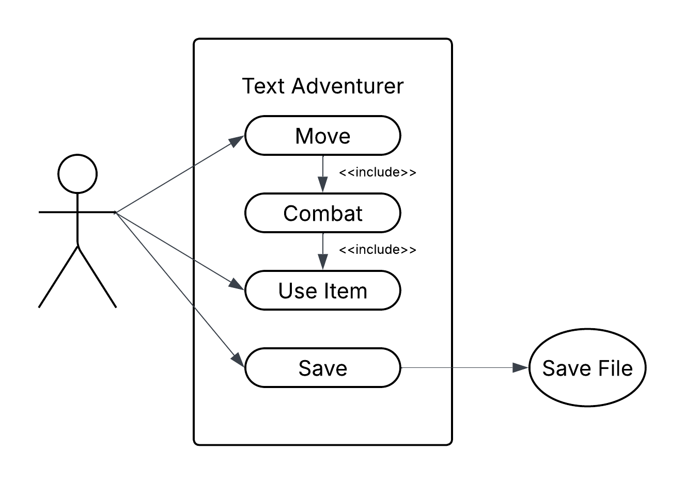


### **Data Flow Diagram**

#### **Level 0:**
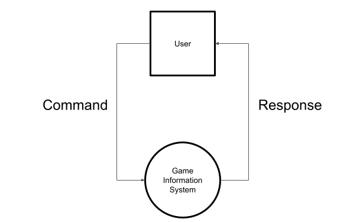

#### **Level 1:**
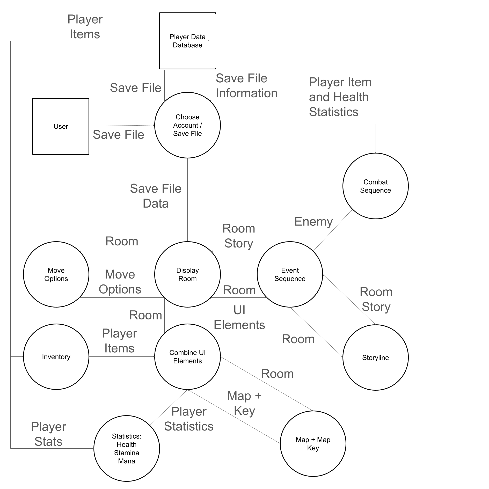


### **Story Boards**
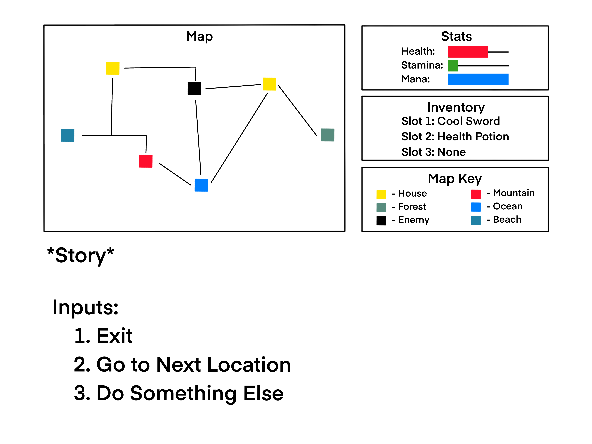    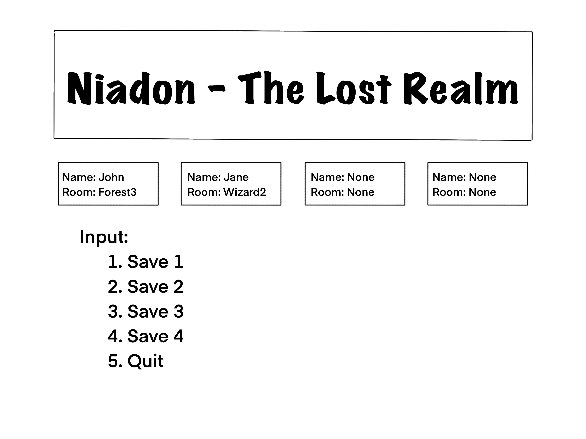
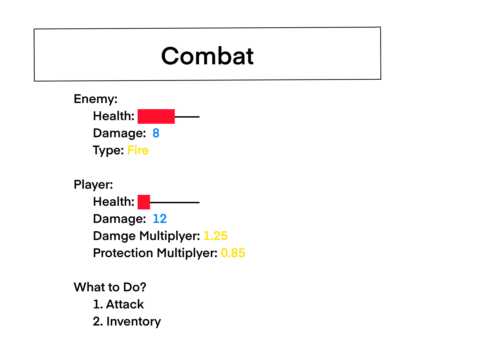    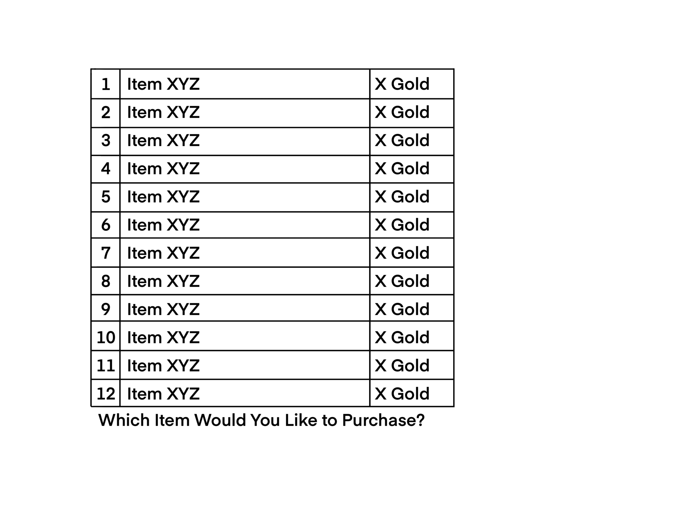

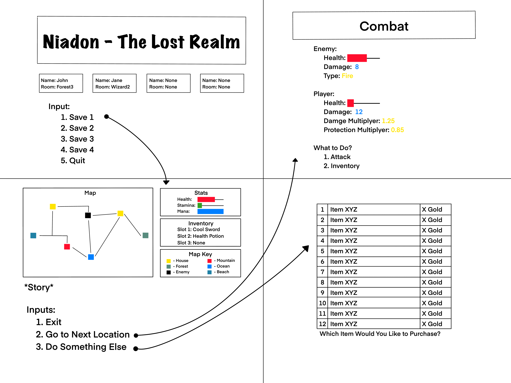 


### Review:

#### main.py
```Python
# --- Imports ---
'''Imports the Necessary Files so the Main file can access informations'''
import items
import story
import UI
import variables

UI.TitleScreen() # From the File 'UI' run Titlescreen
```


#### UI.py
```Python
# --- Imports ---
'''Imports the Necessary Files so the file can access informations'''
import os
import math
import story
import variables
import saves

#--- Displays the UI Screen for the User ---
def PrintMainUI(Room):
    '''This function is the Key UI screen for each Room, where it pulls information from a range of sources, and lays it out in a efficent layout'''
    os.system('cls') # Clears the screen (This makes for a more adaptive, and engaing UI)

    # Each of these retrieves the UI data, i.e StatBars, Maps, and Inventory, and splits them up into their individual lines
    # This allows them to be printed next to eachother by printing it layer by layer rather than section by section
    map_lines = Map(Room).splitlines() # Splits Map lines
    stats_lines = DisplayStats().splitlines() # Splits Stat lines
    inventory_lines = DisplayInventory().splitlines() # Splits Inventory lines
    MapKey_lines = DisplayMapKey().splitlines() # Splits Map Key lines

    side_panel = stats_lines + inventory_lines + MapKey_lines # Alligns the Stat Line, Inventoy Line, and Map Key lines to be ontop of eachother
    max_lines = max(len(map_lines), len(side_panel)) # Calculates how many lines it needs to print for the UI

    print() # Spacer in the Terminal

    for i in range(max_lines): # For each line in Max_Lines
        map_line = map_lines[i] if i < len(map_lines) else "" # Retrieve Map line of the Value of i, or if too big, return blank
        side_line = side_panel[i] if i < len(side_panel) else "" # Retrieve Side Panel line of the Value of i, or if too big, return blank
        print(f"{map_line:<60} {side_line}") # Prints the two elements next to eachother, using the :<60 to keep the side pannel allined if it is bigger than the map

    print() # Spacer in the Terminal

    print(story.Story(Room)) # From the File Story, Retrieves and prnts the story
    print(MoveOptions(Room)) # Prints the Move options for this room
    InputHandling(Room) # Runs the Input handling for this room

def Map(Room):
    '''This functions runs the Map handling for the room, containing all of the maps, for all the rooms'''
    def TitleGenerator(Title):
        '''This function creates a title for each of the rooms, ensuring it is alligned in the center'''
        return f'+{'─'*((27-(math.floor(len(Title)/2)))-6)}--==| {Title} |==--{'─'*((28-(math.ceil(len(Title)/2)))-6)}+'

    if Room == 'Forest1': # If requested the map for Forest1, returns the map for Forest1 (The map doesn't look alligned but it is due to the emojis.)
        return f'''        {TitleGenerator('Dark Forest')}
        │                                                       │
        │           ┌──────☠️           🌲─────┐                 │
        │           │       │           │     │                 │
        │     ⛰️  ───┘       │           │     │                 │
        │                   │           │     └────🏠           │
        │               ☠️ ──┴────🔮     │                       │
        │                │              │                       │
        │        ┌───────┴────────┬─────┤                       │
        │        │                │     └───────┐               │
        │ ██────☠️       🏠       🌲             ├────☠️ ─────👑  │
        │        │       │            🏠────────┘               │
        │        └────┬──┴──┬──────────┘                        │
        │             │     │                                   │
        │             │     └──┐                                │
        │             │        │                                │
        │       🌲  ──┘        │                             ⬆  │
        │                      └────────────🔮               N  │
        │                                                       │
        +───────────────────────────────────────────────────────+'''
    
    elif Room == 'Enemy1': # If requested the map for Enemy1, returns the map for Enemy1
        return f'''        {TitleGenerator('Dark Forest')}
        │                                                       │
        │           ┌──────☠️           🌲─────┐                 │
        │           │       │           │     │                 │
        │     ⛰️  ───┘       │           │     │                 │
        │                   │           │     └────🏠           │
        │               ☠️ ──┴────🔮     │                       │
        │                │              │                       │
        │        ┌───────┴────────┬─────┤                       │
        │        │                │     └───────┐               │
        │ 🌲────██       🏠       🌲             ├────☠️ ─────👑  │
        │        │       │            🏠────────┘               │
        │        └────┬──┴──┬──────────┘                        │
        │             │     │                                   │
        │             │     └──┐                                │
        │             │        │                                │
        │       🌲  ──┘        │                             ⬆  │
        │                      └────────────🔮               N  │
        │                                                       │
        +───────────────────────────────────────────────────────+'''

def MoveOptions(Room):
    '''This function contains the possible moves for each room, and tells the player where they can go'''
    if Room == 'Forest1': # If room is Forest1, return the Move options Inventory, and East
        return '''
            0. Inventory
            1. East
        '''
    
    elif Room == 'Enemy1': # If room is Enemy1, return the Move options Inventory, North, and South
        return '''
            0. Inventory
            1. North
            2. South
        '''

def InputHandling(Room):
    '''This function handles the user inputs for each room'''
    def ReplaceInput():
        '''This function removes incorrect user inputs, and alerts the player their is an issue'''
            print("\033[2A", end="") # Removes the past two lines in the Terminal
            print('Error With Input') # Alerts the Player of the Error with Input
            NextMove = '' # Resets the Player input
            InputHandling(Room) # Re-Runs Input handling

    NextMove = input(f'What do You want to do? ') # Retieves the Input for what the player wants to do

    if Room == 'Forest1': # If the Room is Forest1, continue
        if NextMove == '1': # If the Move input was 1, continue
            PrintMainUI('Enemy1') # Prints the Next UI screen for the Room Ememy1

        elif NextMove == '0': # If the Input was 0, pass (Adding this functionality in a later sprint)
            pass 

        else: # If none of these options, continue
            ReplaceInput() # Re-Runs the Input selection process

    elif Room == 'Enemy1': # If the Room is Enemy1, continue (This was mostly a fill in for and idea as for how the program should handle inputs)
        if NextMove == '1': # If the Move input was 1, continue
            PrintMainUI('Village1') # Prints the Next UI screen for the Room Village1

        # Adding other inputs in later sprints when the final input handling is worked out
            
        elif NextMove == '0':# If the Input was 0, pass (Adding this functionality in a later sprint)
            pass

        else: # If none of these options, continue
            ReplaceInput() # Re-Runs the Input selection process

def DisplayStats():
    '''This function returns the Player statistic's to be printed in the UI (This whole program used to be much simpler, but I wanted the dashes to be white instead of the colour they where origionally, which tripled the complexity of this function)'''
    def StatBar(Stat, Max_Stat):
        '''This function turns the players 'Number Statistics', into visually represented bars, allowing for faster, and more effective communication'''
        StatBar = (math.floor(Stat/(Max_Stat/10)))*'█' # Calculates the amount of Bars depending on Max Health to fit 10 unit bar
        DeadBar = '' # Creates value DeadBar
 
        if StatBar == '' and Stat > 0: # Statbar is blank, but the the player isnt dead, continue
            StatBar = '█' # Adds one bar to stat bar

        elif len(StatBar) > 10: # If the statbar is more than 10 units long (More Health than Max Health - Bonus Health/Extra Life)
            Statbar = '█'*10 # Sets stat bar to 10
            return Statbar # Returns Statbar as Full

        for i in range(0, 10-len(StatBar)): # Calculates how many dashes to add to take up the full amount of space
            DeadBar += f'-' # For each blank space, adds a dash
        return StatBar + f'\033[37m{DeadBar}' # Returns the completed bar plus the Missing health (In White), back to the function that called it.
    
    # This returns the 'Stat Block', completed with fully coloured bars representing the players statistics and values, also giving them a numericl value.
    return f'''+───────────--==| Stats |==--───────────+
│                                       │
│   Health:  ♥️  \033[31m{StatBar(variables.Health, variables.Max_Health)} \033[0m {f'({variables.Health}/{variables.Max_Health})':<12}│
│   Stamina: 🔋 \033[32m{StatBar(variables.Stamina, variables.Max_Stamina)} \033[0m {f'({variables.Stamina}/{variables.Max_Stamina})':<12}│
│   Mana:    💠 \033[34m{StatBar(variables.Mana, variables.Max_Mana)} \033[0m {f'({variables.Mana}/{variables.Max_Mana})':<12}│
│                                       │
+───────────────────────────────────────+'''

def DisplayInventory():
    '''This function returns the player inventory block, which is a grid system (Using the :<Number) to align each of the title for what it is with the equipment the player has by retrieving it from the variables file'''

    return f'''+────────────────────────--==| Inventory |==--────────────────────────+
│   {'🪙  Gold':<12} -   {variables.Gold:<48} |
│   {'Weapon':<12} -   {variables.Inventory['WeaponSlot']:<15} {'Chestplate':<12} -   {variables.Inventory['ChestplateSlot']:<15} │
│   {'Helmet':<12} -   {variables.Inventory['HelmetSlot']:<15} {'Boots':<12} -   {variables.Inventory['BootSlot']:<15} │
+─────────────────────────────────────────────────────────────────────+
│   {variables.Inventory['OtherSlot1']['Item']:<18} -   {variables.Inventory['OtherSlot1']['Qty']:<9} {variables.Inventory['OtherSlot2']['Item']:<18} -   {variables.Inventory['OtherSlot2']['Qty']:<9} │
│   {variables.Inventory['OtherSlot3']['Item']:<18} -   {variables.Inventory['OtherSlot3']['Qty']:<9} {variables.Inventory['OtherSlot4']['Item']:<18} -   {variables.Inventory['OtherSlot4']['Qty']:<9} │
+─────────────────────────────────────────────────────────────────────+ '''

def DisplayMapKey():
    '''This function returns the Map Key block, which is used to make sense of the map and its icon based system'''
    return f'''+─────────────────────────--==| Map Key |==--─────────────────────────+
│   ██ - You              🔮 - Wizard Tower                           │
│   🏠 - Village          ☠️  - Enemy            👑 - Goblin King      │
│   🌲 - Forest           ⛰️  - Mountain                               │
+─────────────────────────────────────────────────────────────────────+'''

def TitleScreen():
    '''This function runs the process for the Title Screen - Some of the functionality works, but most is a fill in until the later sprints where it will be more cohesively filled out'''
    os.system('cls') # Clears the Terminal for a more sleek and engaing appearence.
    saves.Load() # Fill in for loading saves later
    # Prints the Titlescreen in large Ascii Letters
    # Welcomes the User
    # Shows them their save files and gives them instrusctions on how to pick
    print(f'''
    +------------------------------------------------------------------------------------------------------------------------------------+     
    |                                                                                                                                    |
    |   ███╗   ██╗██╗ █████╗ ██████╗  ██████╗ ███╗   ██╗          _____ _            _              _     ____            _              |
    |   ████╗  ██║██║██╔══██╗██╔══██╗██╔═══██╗████╗  ██║         |_   _| |__   ___  | |    ___  ___| |_  |  _ \ ___  __ _| |_ __ ___     |
    |   ██╔██╗ ██║██║███████║██║  ██║██║   ██║██╔██╗ ██║  _____    | | | '_ \ / _ \ | |   / _ \/ __| __| | |_) / _ \/ _` | | '_ ` _ \    |
    |   ██║╚██╗██║██║██╔══██║██║  ██║██║   ██║██║╚██╗██║ |_____|   | | | | | |  __/ | |__| (_) \__ \ |_  |  _ <  __/ (_| | | | | | | |   |
    |   ██║ ╚████║██║██║  ██║██████╔╝╚██████╔╝██║ ╚████║           |_| |_| |_|\___| |_____\___/|___/\__| |_| \_\___|\__,_|_|_| |_| |_|   |
    |   ╚═╝  ╚═══╝╚═╝╚═╝  ╚═╝╚═════╝  ╚═════╝ ╚═╝  ╚═══╝                                                                                 |
    |                                                                                                                                    |
    +------------------------------------------------------------------------------------------------------------------------------------+     
          
   Welcome to Your Adventure, Continue with your adventure, or start a new one!
    
    +----------Save 1----------+    +----------Save 2----------+    +----------Save 3----------+    +----------Save 4----------+
    |Name: {variables.Name:<20}|    |Name: {variables.Name:<20}|    |Name: {variables.Name:<20}|    |Name: {variables.Name:<20}|
    |Room: {variables.Room:<20}|    |Room: {variables.Room:<20}|    |Room: {variables.Room:<20}|    |Room: {variables.Room:<20}|
    +--------------------------+    +--------------------------+    +--------------------------+    +--------------------------+

    0. Exit
    
    1. Save 1
    2. Save 2
    3. Save 3
    4. Save 4

    ''')

    def TitleSelection():
        '''This function allow the user to select which save file they would like to chose, and then runs dummy code until other parts of the code are finished in later sprints'''
        def ReplaceInput():
            '''This function removes incorrect user inputs, and alerts the player their is an issue'''
            print("\033[2A", end="") # Removes the past two lines in the Terminal
            print('Error With Input') # Alerts the Player of the Error with Input
            SaveSelection = '' # Resets the Player input
            TitleSelection() # Re-Runs Input handling
        
        SaveSelection = input('Choice: ') # Retrieves the User input

        if SaveSelection == '0': # If user input is 0, quits the program
            quit()

        elif SaveSelection == '1': # If the user input is 1, Runs the MainUI for the Room Forest1 (Dummy Code)
            PrintMainUI('Forest1')

        elif SaveSelection == '2': # If the user input is 2, Runs the MainUI for the Room Enemy1 (Dummy Code)
            PrintMainUI('Enemy1')

        elif SaveSelection == '3': # If the user input is 3, Runs the MainUI for the Room Enemy1 (Dummy Code)
            PrintMainUI('Enemy1')

        elif SaveSelection == '4': # If the user input is 4, Runs the MainUI for the Room Enemy1 (Dummy Code)
            PrintMainUI('Enemy1')

        else: # If input is not known, runs replace input, restarting the input process
            ReplaceInput()
    
    TitleSelection() # Runs the Title Selection process as the end of the Printing the Titlescreen UI elements.
```

#### story.py
```Python
# --- Imports ---
'''Imports the Necessary Files so the Main file can access informations'''
import math

def Story(Room):
    '''This function consolidates the story line, allowing for simpler expansion in future sprints. It works by taking a Room input, and returning the neccessary story elements.'''
    if Room == 'Forest1': # If the Room is Forest1
        return 'Interesting Story' # Returns Fill in Text
    
    elif Room == 'Enemy1': # if the Room is Enemy1
        return 'You Have Encountered and Enemy!!! You will have to fight' # Returns Fill in Text
    
def Title(Room):
    '''This function, similar to story, returns a title for each of the rooms'''
    if Room == 'Forest1': # If room is Forest1
        return TitleGenerator('Dark Forest') # Returns a title made with TitleGerator for the Title 'Dark Forest'


def TitleGenerator(Title):
    '''This function generates titles that are centered, bassed on the length of the title'''
    # Generates the Top wall of the box
    # Calculates how much padding is required on each side to center it (If it is odd it is slightly to the left)
    # Generates the Bottom wall of the box
    # Returns the Generated Title
    return f'''
    +{'-'*64}+
    |{' '*((32-(math.floor(len(Title)/2)))-6)}--==| {Title} |==--{' '*((32-(math.ceil(len(Title)/2)))-6)}|
    +{'-'*64}+
    '''
```

####  variables.py
```Python
'''This file contains all the neccessary Variables, that need to be accessed and changed when being used accross files'''
Health = 98 # Sets Health to 98
Max_Health = 100 # Sets Max Health to 100
Stamina = 65 # Sets Stamina to 65
Max_Stamina = 100 # Sets Max Stamina to 100
Mana = 23 # Sets Mana to 23
Max_Mana = 100 # Sets Max Mana to 100

Gold = 5 # Sets Gold to 5

Name = 'John' # Sets name to John
Room = 'Dark Forest' # Sets Room to 'Dark Forest'

#--- Weapons ---
Stick = 'Stick' # Sets stick to 'Stick'
Wooden_Sword = 'Wooden_Sword' # Sets Wooden_Sword to 'Wooden_Sword'
Iron_Sword = 'Iron_Sword' # Sets Iron_Sword to 'Iron_Sword'

#--- Helmets ---
None_Helmet = 'None' # Sets None_Helmet = 'None' 

#--- ChestPlate ---
None_Chestplate = 'None'# Sets None_Chestplate = 'None' 

#--- Boot ---
None_Boot = 'None'# Sets None_Boot = 'None' 

#--- Item ---
None_Item = 'None'# Sets None_Item = 'None' 

Inventory = { # Creates a Dictionary based on the information set previously (Designed to be used later with saving functionality)
            'Player_Name': Name,
            'WeaponSlot': Wooden_Sword, 
            'HelmetSlot': None_Helmet, 
            'ChestplateSlot': None_Chestplate,
            'BootSlot': None_Boot,
            'OtherSlot1': {'Item': None_Item, 'Qty': 0},
            'OtherSlot2': {'Item': None_Item, 'Qty': 0},
            'OtherSlot3': {'Item': None_Item, 'Qty': 0},
            'OtherSlot4': {'Item': None_Item, 'Qty': 0}
    }
```

### Review Questions:

#### Evaluate how effectively your project meets the functional and non-functional requirements defined in your planning.
 - The project meets most of the planned functional and non-functional requirements effectively, offering clear player statistics, intuitive ASCII and emoji-based UI elements, and responsive text-based interactions. Players can view and manage inventory, health, and location, with meaningful turn-based gameplay that includes multiple decision points and combat strategy. The game performs quickly due to its lightweight design and organized file structure, ensuring consistent tracking of stats and player actions. While usability is already strong with labeled commands and accessible options, some features, such as expanded scenario interactions and second-chance events, will be more fully implimented and polished in the second and third sprint.

#### Analyse the performance of your program against the key use-cases you identified.
 - The program largely behaves as expected and handles input/output effectively according to the planned design. Basic command systems have been successfully implemented, with more advanced interactions scheduled for future sprints. Input handling works well, although there is a minor bug where incorrect inputs are removed, but the display of previous inputs isn't fully cleared—this visual glitch does not affect functionality or performance and is planned to be resolved in a later sprint. Player statistics such as health, stamina, mana, and location are clearly displayed, making excellent use of terminal space, and emojis render correctly, though their irregular print sizes present a slight challenge during development. The game provides clear textual feedback for player actions and events, and the map system effectively tracks player movement in real time. Because the game operates on a turn-based system, player stats are accurately updated after each action, keeping the interface consistent and informative throughout gameplay.

#### Assess the quality of your code in terms of readability, structure, and maintainability.
 - Based on Feedback from my previous task, I took lots of extra time in planning out my code to be more easily readable and conventional. I have made heavy uses of functions to sperate code blocks into smaller chuncks that can be more easily understood, and maintained. Furthermore, I have spread my code accross multiple files, making it easier and faster to fund and modify parts of the code based on the function. Their is also a strong use of comments to explain what code does, and why it works. These aspects of my code make my code a high qualilty in terms of readability, structure, and maintainaility.

#### Explain the improvements that should be made in the next stage of development.
 - In the next stage of development, the primary focus will be on completing and refining the movement, combat, and trading systems, which are currently only partially implemented. These features are essential for the core gameplay loop and will provide players with a more interactive and dynamic experience. Alongside these enhancements, improvements to code quality will also be prioritized. Although the codebase is already readable due to previous planning, the next sprint will focus on adding more detailed comments throughout the program to better document how each system functions. Additionally, there are plans to implement a more robust and efficient system for tracking the player’s location, which will improve consistency across scenes and interactions. These refinements will help streamline development in future sprints and make the codebase easier to expand and maintain.

# Sprint 2

### Structure Chart
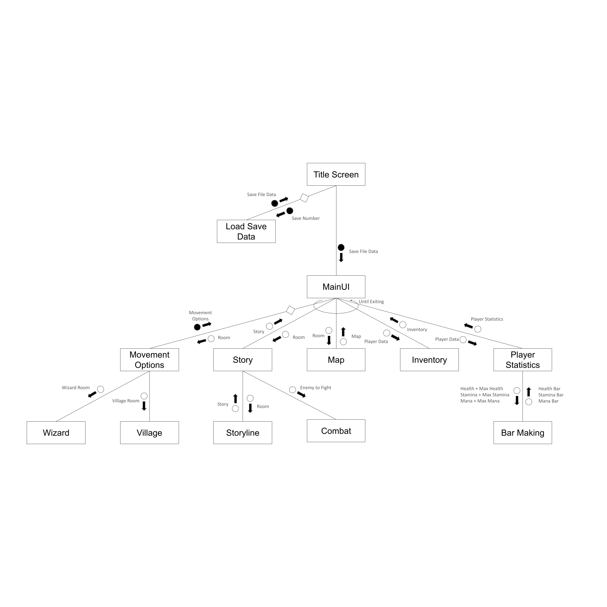


### Algorithms

#### Mainline (PrintMainUI)
``` 
BEGIN PrintMainUI (Room)
	Exited = False
    Clear Terminal


	IF User Health is less than or Equal to 0 THEN
		Player (Died)
    ELIF Enemy Health is less than or Equal to 0 THEN
        Died (‘No Stamina’)
    ENDIF

    FOR i IN 1 TO max_lines STEP 1
            map_line = map_lines[i] if i < len(map_lines) else ""
            side_line = side_panel[i] if i < len(side_panel) else ""

            map_width = wcswidth (map_line)
            padding = max(0, 60 - map_width)
            print(map_line + ' ' * padding + side_line)

    User.Location = Room

    Display

    Display Story (Room)

    Display

    WHILE true
        IF Exited is False THEN
            SET User.Room to True
            Input_Selection(MoveOptions(Room))
                        ClearLines ( len (MoveOptions (Room) ) + 3)
        ELSE
            BREAK
        ENDIF

    ENDWHILE

END PrintMainUI (Room)
```

#### Subroutine (Combat)
```
BEGIN Combat (Enemy, Room)
	IF Enemy.type = ‘Fir’ THEN
		Type = ‘Fire’
	ELIF Enemy.type = ‘Wat’ THEN
		Type = ‘Water’
	ELIF Enemy.type = ‘Nat’ THEN
		Type = ‘Nature’
	ENDIF
	
	Display You have Encountered an Enemy

	WHILE true
		Exited = False
		Display Enemy and Player Statistics
		IF Enemy.Health <= 0 THEN
			ClearLines (17)
			Display You have Defeated Enemy
			User.WeaponSlot.level += Enemy.Level/2
			User.Room = True
			END Combat (Enemy, Room)

		ELIF User.Health[‘Health’] <= 0 THEN
			Died (Enemy.name)
			END Combat (Enemy, Room)

        Input_Selection (Attack, Use Item)

        IF Exited = False THEN
            Enemy.Attacking (User)

        Clearlines (20)

    ENDWHILE

END Combat (Enemy, Room)

```

#### Subroutine (Statbar)
```
BEGIN Statbar (Stat, Max_Stat)
	StatBar = (math.floor(Stat/(Max_Stat/10)))*'█'
	Deadbar = ‘’
	
	IF StatBar = ‘’ AND Stat > 0 THEN
		StatBar = '█'
	ELIF len (StatBar) > 10 THEN
		StatBar = '█'*10

	FOR i IN 1 TO 10 - len (StatBar) STEP 1
		Deadbar += ‘-’

	Return StatBar + *White* Deadbar

END Statbar (Stat, Max_Stat)
```

#### Flowcharts
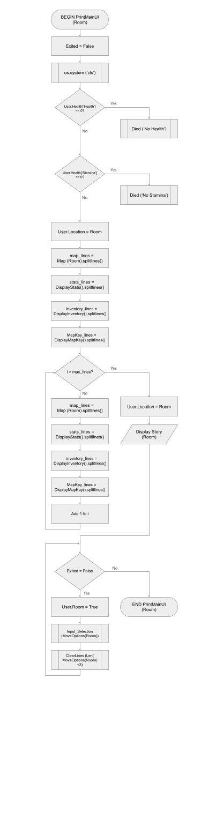  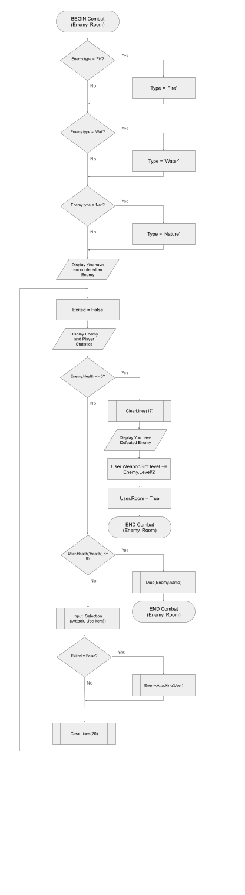  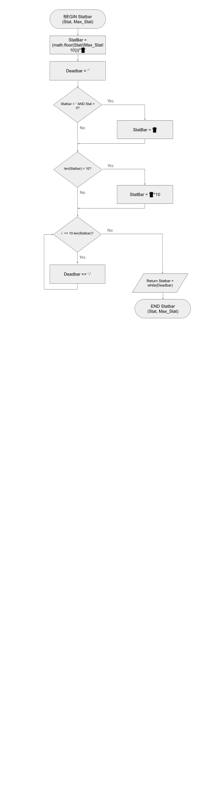

### Review Questions

#### Evaluate how effectively your project meets the functional and non-functional requirements defined in your planning.
 - The project successfully meets the majority of its functional and non-functional requirements as outlined in the initial planning documents. Core features such as displaying player statistics (health, stamina, mana, inventory, gold, location) and supporting terminal-based interaction using simplified input commands are fully implemented and operational. Originally planned to use directional inputs like "N", "S", "E", and "W" for movement, the system has since been refined to use a numbered input system instead. This change improves usability by allowing users to make decisions more quickly and intuitively, streamlining the experience and minimizing typing errors.

 - The system also meets key non-functional goals. It performs efficiently due to its text-based design, quickly handling scene changes and updates with minimal delay. User feedback is clear and consistent throughout, and reliable input handling ensures a smooth user experience. The program responds eficiently, and directly to invalid inputs without crashing, fulfilling error handling. Reliability is further supported through the use of classes and structured systems for statistics and interactions.

 - The final two areas that still require work are the inventory screen, which I want to refine to display more relevent data, and the Boss Battle scene, which still needs to be developed.

#### Analyse the performance of your program against the key use-cases you identified.
 - The program performs well across the key use-cases defined in the design phase. Movement between areas is handled using a numbered input system rather than the initially planned directional (N/S/E/W) system. This update has improved ease of use and reduced input errors, allowing for quicker navigation and a more streamlined experience.

 - Combat encounters function as expected, with turn-based logic that allows players to equip a physical weapon and engage in multi-turn battles. Damage is calculated based on the player’s equipped weapon and the enemy’s attributes, and players are able to adapt their strategy across rounds. The system responds accurately to player choices, such as attacking or using items, and clearly displays the results of each action.

 - Players can view their statistics and inventory at any time, completing my data retrieval reuirement. Inventory interaction, trading, and exploration function correctly, and stamina is managed consistently during travel. Input validation has been thoroughly tested, and no major errors or crashes have occurred thanks to the robust input handling function.

 - Although the final boss fight and story progression are still in development, the core use-cases for interaction, navigation, combat, and stat management are effectively implemented.

#### Assess the quality of your code in terms of readability, structure, and maintainability.
 - Overall, the code is high quality in terms of readability and maintainability. My code has conistent and cohesive comments to thoroughly explain logic, which improves readability for others.

 - The use of classes for modular components (e.g., Player, Enemy, Villager) improves reusability. Each of the functions efficiently uses parameters to effecively and effciently transmit code throughout the system's range of functions.

 - Currently, the entire program resides in a single file due to previous issues with circular imports. However, there is a plan to split the program into separate files again (e.g., for inventory, UI, enemies, etc.), which would greatly enhance maintainability and organization.

#### Explain the improvements that should be made in the next stage of development.
 - The next stage of development should focus on both feature completion and structural refinement:

    - Feature Enhancements:

        - Finalize the inventory system to improve its visual layout and include additional data (e.g. Show more items, and more statistics)

        - Implement the boss fight to complete the game’s core narrative and difficulty arc.

        - Integrate the story and scripted events to enhance immersion and give purpose to gameplay progression.

    - Code Improvements:

        - Reorganize the code into multiple Python modules once circular import issues are resolved. This will make the program easier to scale and debug.

 - These improvements will not only polish the game experience but also position the project as a well-structured, maintainable application.

# Sprint 3

### UML Class Diagram
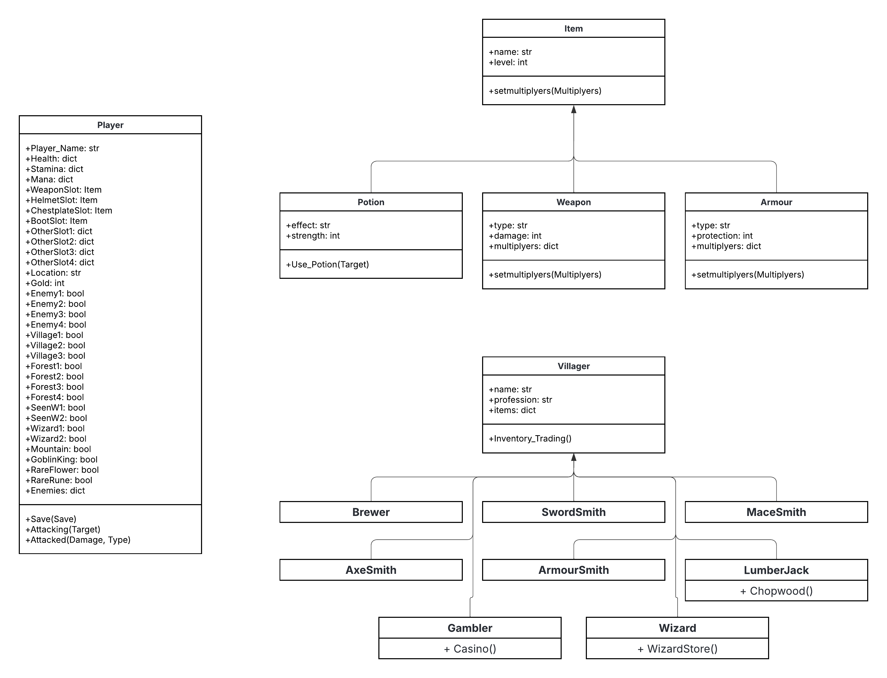

### Review Questions


# Sprint 4

## Final Evaluation Questions
### Explain how you could improve your system in future updates. Analyse the impact these updates could have on the user experience.

My current system was designed with robustness in mind—a stable and expandable foundation for future content. While the base game functions well and delivers the core experience, there are several key improvements I would like to implement in future updates to enhance both gameplay depth and user experience.

1. **Expanding Game Content and World Exploration**

One of the most significant improvements would be to add more content to the game. At present, the player’s experience is somewhat limited in terms of exploration, available quests, and meaningful interactions. I would like to add more rooms, unique characters, hidden areas, diverse enemies, and side quests that reward exploration and strategic thinking.

**Impact on User Experience:**

Adding more content would directly improve engagement and replayability. Players would feel more immersed in the game world and more motivated to continue playing. It would also give them a greater sense of progression and accomplishment, reducing repetition and increasing the overall enjoyment of the game.

2. **Enhancing Data Presentation and Gameplay Clarity**

Another key area for improvement is how data is calculated and displayed. Currently, while stats like health, stamina, and damage exist, their calculation and visual representation could be made clearer and more intuitive. For example, showing real-time stat changes after actions, clearer descriptions of effects (e.g. elemental damage multipliers), and more informative UI feedback could help players better understand the consequences of their decisions.

**Impact on User Experience:**

Improved clarity would make the game's core mechanics more accessible, especially for new players. This would reduce confusion, allow for more strategic planning, and ultimately create a smoother, more satisfying experience. It helps players feel in control and capable, which is crucial in an RPG-style system.

3. **Deepening the Magic and Mana System**

Finally, I want to further develop the game’s magic and mana systems. While these elements exist, their current implementation is limited. I aim to introduce more types of magical abilities, enchanted gear that interacts with mana, and even mana-based puzzles or combat effects. Mana would become a key resource players manage carefully, and magic could be customized or leveled up over time.

**Impact on User Experience:**

A more complex and rewarding magic system would provide players with alternative playstyles and enhance combat variety. It encourages creativity and planning, as players can specialize in magical strategies rather than relying solely on weapons or brute force. This added depth also allows for richer character builds and improves overall game balance by providing viable alternatives to physical attacks.

By focusing on expanding content, improving system transparency, and enhancing underused gameplay mechanics like magic, future updates would significantly improve player satisfaction, engagement, and replay value. These changes build upon the current strong foundation and ensure the system continues to grow in complexity and enjoyment.

4. **Better Code Management:**

During the beginning of this task, the original goal was to break up my code, into a variety of files, to allow for more efficient development and performance of the system. Unfortunately, during the creation of the program, too many errors where being produced due to this goal. While I am confident it can be achieved, with my current skill level and abilities, breaking my program down into multiple files would require more time than I had for the task.

**Impact on User Experience:**

Breaking the program down into multiple files would have a larger focus on the developers side of the program, allowing them to find and solve errors faster and more efficiently. However, this still would impact the users experience. It would mean their problems would be solved faster, and more effectively.

### Evaluate the system in terms of how well it meets the requirements and specifications.

**Functional Requirements**

Evaluation of the System Against Requirements and Specifications
My system effectively meets the functional and non-functional requirements outlined in its initial design, offering a responsive, accessible, and feature-complete gameplay experience. Each requirement is addressed through thoughtful design decisions, and the system performs reliably across its key mechanics.

**Functional Requirements:**

The system meets all data retrieval expectations. Players can view essential statistics such as health, stamina, mana, inventory, and gold, at any point via the main UI. This is achieved through consistent updates and clear terminal output, ensuring users have constant updates on statistics and events.

The user interface uses ASCII art and emojis to deliver an engaging experience. Elements like hearts (❤️), and custom coloured terminal outputs allow for quick visual recognition, while intuitive command inputs (e.g.1–X) ensure fluid interaction. Scene transitions are clean and formatted, aligning with expectations for clarity and immersion.

To meet my data display criteria, the system successfully communicates in-game events through descriptive narration and clear outcomes. Players are notified during encounters, and combat sequences include multiple turns and second-chance mechanics, enhancing decision-making without overwhelming the user.

**Non-Functional Requirements:**

Performance is consistently strong. As a turn-based text system, transitions between actions are near-instant, with room and combat scenes loading in under half a second. Furthermore, the inclusion of timed text output ("swipe-style") maintains user attention without overloading the player, balancing speed with readability.

The system demonstrates high reliability through using a variety of functions and processes, key systems such as stats, combat, and inventory are isolated into separate functions and classes. This avoids unintended side effects and allows each system to function predictably and independently.

Usability and accessibility are clearly prioritized. The interface uses high-contrast text, minimalistic design, and a simplified input model to accommodate users with varied needs. Command options are consistently labeled, and help prompts ensure that players can navigate without confusion.

**Functional Specifications:**

The system meets all outlined user requirements, including access to stats, real-time feedback on in-game actions, and the ability to interact meaningfully through movement, combat, trading, and magic. While the magic system is currently basic, it satisfies initial specifications and lays groundwork for future expansion.

Inputs and outputs are handled gracefully. Valid inputs trigger appropriate actions (movement, combat, etc.), while invalid ones prompt corrective feedback. This ensures users stay informed and engaged, even when errors occur.

All core systems—combat, movement, inventory, trading, and magic—are implemented and functional. These mechanics are interconnected and support overall progression through exploration, decision-making, and character growth. The system responds appropriately to each input, contributing to a seamless player experience.

User interaction is efficient and effective through consistent use of clear text prompts. Even more complex actions during the program are broken down into simple, understandable actions for the USer to make clear and informed decisions.

My program has strong input handling, with my extensive texting finding that no inputs where found to be invalid, or to be processed with incorrect data.

**Non-Functional Specifications:**

The program delivers strong performance, loading each new game state in an effecive and efficient manner. This is strongly due to my efficient a through use of functions and loops throughout the program, that reduce redundent code, and increase the efficiency of the program.

In terms of accessibility, the system meets its goals by using terminal input, high-contrast visuals, and straightforward commands. These choices make it approachable for a broad audience, including users with low vision or limited technical familiarity.

Lastly, reliability is achieved through validation, input constraints, and modular control of data flow. The program avoids critical errors and, when issues do occur, informs the player how to correct them, through the use of Meaningful Error Messages, best seen in the Casino program.

**Conclusion:**

Overall, the system cohesively fulfills its design intentions. It is reliable, accessible, and functionally complete, offering an engaging and responsive experience to players. All specified requirements are met, with particular strengths in modularity, clarity of interaction, and performance. Areas like the magic system are identified for future enhancement but already meet baseline expectations. The foundation is solid, scalable, and ready for further development.

### Evaluate your processes in terms of project management.

For this project, the Use of the Agile sprint method as opposed to the waterfall method provided a strong curveball in terms of time management. This was the first project I have done with this approach, and it has had a strong impact on the project's time management. The first key difference with the Agile methods time management, is that I found it difficult to estimate the length tasks would take. Such as implimenting a movement system, or adding a inventory. As I have experienced with my other tasks, my estimations for how long implimenting features would take was generally accurate, allowing me to stay on schedule in those tasks. However, in this task, I found time management siginificantly more difficult, with my estimations being extremely wrong, and tasks taking either significantly longer or shorter that I first would have expected. This also meant sticking to the Gantt chart was difficult. My progress does allign with the Gantt charts general direction, but towards the end, my progress does come up a little short, and their is a heavy load of work that was pushed towards the end of the task.

These reasons the resulted in my time management for the task to be quite poor, and being left with significant work to accomplish, very close to the deadline. I'm confident that as I progress with tasks similar to this, using the Agile method, my ability to time manage these projects will improve, but as of now, my skill in the Agile Method, and this task specifically has a lot to work on to get it to the same level of time management I have for my other workflows.

### Evaluate your project in relation to peer feedback.

**Barry:** Miles’s system clearly meets all of his planned criteria and specifications. Core features like movement, combat, inventory, and stat tracking are functional and reliable, and the use of ASCII art and emoji adds friendlyness to the terminal-based interface. However, the biggest weakness is the lack of content. While the foundation is strong, there isn’t much variety in the world, enemies, or interactions, which can make the gameplay feel repetitive after a while. The magic and mana system is also underused and could be expanded to add more depth and strategy. Overall, it’s a well-built system that would really benefit from more content to keep players engaged longer.

**Yyoung:** One of the first things I noticed about Miles’s game is how smooth it runs. There’s no lag between actions, and the text-based UI is clean and easy to follow. I really liked how emojis and ASCII were used to make everything clearer and more interesting, especially for things like stats and the map. The system also does a good job handling user inputs, even when you enter something wrong, it doesn’t crash and instead helps guide you back on track. But after playing for a bit, I found myself getting board of the content. The core mechanics like movement and combat are solid, but it felt like I was doing similar things over and over again. It would be cool to see more random events, characters with actual dialogue, or even decisions that change what happens next. The magic system was there but didn’t really have much of a role, which was a bit of a letdown since it could make combat more interesting. Still, the structure of the game was good, and with a bit more content and uniqueness to each run, it could definately be a fun and engaging game.

One of Barry and Yyoung's key pieces of feedback was the lack of content in the game, and I completely agree with that observation. Even though my game has a good range of features and mechanics—like movement, combat, inventory, and magic, I didn’t really use them to their full potential. Because of that, the game can feel a bit empty or repetitive after a while. There are systems in place, but not enough interesting things happening with them, so the player doesn’t always feel like they’re progressing or discovering new things. In future versions of this project, or even in new projects, I want to spend more time making sure that the features I add actually get used in meaningful ways. That would help the game feel more complete and enjoyable overall.

I was glad that both Barry and Yyoung mentioned the ASCII art in a positive way, as I too feel it contributes positively to the program. I also appricated Yyoungs comment of the imput handling, and it being about to handle a varity of inputs, right or wrong, and still continue. For future projects however, I would like to attempt at a more organised way of dealing with error handling - i.e Giving each error a Unique Code as seen in larger software packages, to make error messagers more meaningful, and solveable. I also think this will increase the productivity of me developing it, as I will have a more thorough process of finding where problems are occuring, and allow me to spend more time working on them.


### Justify your use of OOP class features
Throughout the development of my game, I made strong use of Object-Oriented Programming (OOP) principles to structure and manage the different parts of my system. Using classes allowed me to separate different types of data and behavior into logical groups, which made the code more organised, easier to read, and much easier to update or expand in the future. Each class I created had a clear purpose, and I used key OOP features like encapsulation, attributes, and methods to make the game systems work smoothly.

One of the main classes in my game was the Player class. This class held all of the player’s important data like health, stamina, mana, gold, inventory, and current location. By storing all this in one class, I could easily pass around the player as a single object between different parts of the program. It also made for much more efficient processing of saving data, with every Player Specific Variable being tied to the Player itself, making it easier to load and unload data forr ecah save. I also included methods inside the Player class that impacted the player specifically, such as the combat and saving system. This follows good OOP practice because it keeps both the data and the functions that affect that data in one place, making it easier to control and understand.

Another important class was the Enemy class. This class had attributes like name, type (Fire, Water, Nature), health, and attack damage. I also added an elemental type system, where enemies had strengths and weaknesses based on the weapon used against them. This made use of class inheritance and logic within the methods to calculate damage correctly based on enemy type. Having enemies as a class made it easier to generate different types of enemies and keep their logic consistent, especially when I needed to check their stats or run combat functions.

I also used a Weapon and Armour class to manage equipment. Weapons had attributes like base damage and elemental type, while armour had protection. These classes were used when calculating combat results, so the player’s equipped gear directly affected how much damage they dealt or took. Again, having gear in their own classes made it easy to switch items, store them in inventories. I could also expand these classes easily later on with special effects or unique traits, without changing how the rest of the system works, highlighting the key modularity for Object Oriented Programs.

The final class system I used was for the Villagers. To create these, I create one main Villager class, with attributes such as name, profession, and items. It also contained, importantly, the  Then, I created a variety of subclasses, such as Brewer, Armoursmith, and Swordsmith.